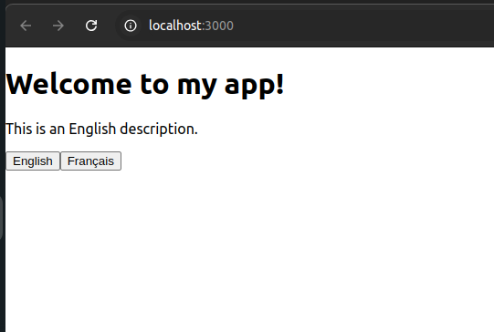
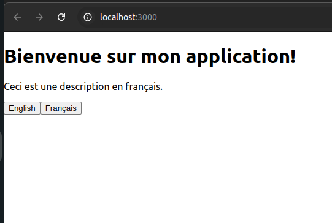

# 🌟 Getting Started with React + TypeScript + i18n

This project was bootstrapped with [Create React App](https://github.com/facebook/create-react-app) and is fully configured with **i18n (internationalization) support** using `react-i18next`.

---

## 📌 Steps to Create the React + TypeScript + i18n App from Scratch

### 1️⃣ Install Node.js
Ensure you have **Node.js (LTS version)** installed. You can check your version with:

```bash
node -v
npm -v
```

If Node.js is not installed, download it from [nodejs.org](https://nodejs.org/).

### 2️⃣ Create a New React + TypeScript Project

Run the following command to create a new project:

```bash
npx create-react-app my-i18n-app --template typescript
```

Once created, navigate into the project directory:

```bash
cd my-i18n-app
```

### 3️⃣ Install i18n Dependencies

Run the following command to install the necessary dependencies:

```bash
npm install i18next react-i18next i18next-browser-languagedetector
```

---

## 📂 Project Structure

After installing the dependencies, the project will have the following structure:

```
my-i18n-app/
├── node_modules/
├── public/
│   ├── index.html
│   └── favicon.ico
├── src/
│   ├── i18n/
│   │   ├── en/translation.json
│   │   ├── fr/translation.json
│   │   └── i18n.ts
│   ├── App.tsx
│   ├── index.tsx
│   ├── react-i18next.d.ts
│   ├── tsconfig.json
│   ├── package.json
│   └── README.md
├── package-lock.json
├── tsconfig.json
└── .gitignore
```

---

## 🛠 Configure i18n

### ✅ Step 1: Create the `src/i18n/` Folder

Inside `src/`, create an `i18n/` folder with **language files**.

#### **src/i18n/en/translation.json** (English Translations)
```json
{
  "welcome": "Welcome to my app!",
  "description": "This is an English description."
}
```

#### **src/i18n/fr/translation.json** (French Translations)
```json
{
  "welcome": "Bienvenue sur mon application!",
  "description": "Ceci est une description en français."
}
```

### ✅ Step 2: Configure `i18n.ts`

Create the file `src/i18n/i18n.ts` and add the following code:

```ts
import i18n from 'i18next';
import { initReactI18next } from 'react-i18next';
import LanguageDetector from 'i18next-browser-languagedetector';

import translationEN from './en/translation.json';
import translationFR from './fr/translation.json';

const resources = {
  en: { translation: translationEN },
  fr: { translation: translationFR },
};

i18n
  .use(LanguageDetector)
  .use(initReactI18next)
  .init({
    resources,
    lng: 'en',
    fallbackLng: 'en',
    interpolation: { escapeValue: false },
  });

export default i18n;
```

### ✅ Step 3: TypeScript Type Definitions (`react-i18next.d.ts`)

Create the file `src/react-i18next.d.ts` and add:

```ts
import "i18next";
import translation from "./i18n/en/translation.json";

declare module "i18next" {
  interface CustomTypeOptions {
    defaultNS: "translation";
    resources: {
      translation: typeof translation;
    };
  }
}
```

---

## 🚀 Using i18n in the App

Modify `src/App.tsx` to use the translation function:

```tsx
import React from "react";
import { useTranslation } from "react-i18next";
import "./i18n/i18n"; // Ensure i18n is initialized

const App: React.FC = () => {
  const { t, i18n } = useTranslation();

  const changeLanguage = (lng: string) => {
    i18n.changeLanguage(lng);
  };

  return (
    <div>
      <h1>{t("welcome")}</h1>
      <p>{t("description")}</p>

      <button onClick={() => changeLanguage("en")}>English</button>
      <button onClick={() => changeLanguage("fr")}>Français</button>
    </div>
  );
};

export default App;
```

---

## 🛠 Configure TypeScript (`tsconfig.json`)

Ensure `tsconfig.json` includes the following settings:

```json
{
  "compilerOptions": {
    "target": "ESNext",
    "lib": ["DOM", "DOM.Iterable", "ESNext"],
    "allowJs": true,
    "skipLibCheck": true,
    "esModuleInterop": true,
    "allowSyntheticDefaultImports": true,
    "strict": true,
    "forceConsistentCasingInFileNames": true,
    "noFallthroughCasesInSwitch": true,
    "module": "ESNext",
    "moduleResolution": "node",
    "resolveJsonModule": true,
    "isolatedModules": true,
    "noEmit": true,
    "jsx": "react-jsx"
  },
  "include": ["src"]
}
```

---

## 🎯 Run the Application

### ✅ 1. Install Dependencies

```bash
npm install
```

### ✅ 2. Start the App

```bash
npm start
```

Runs the app in **development mode** at [http://localhost:3000](http://localhost:3000).

### ✅ 3. Run TypeScript Type Checking

```bash
npx tsc --noEmit
```

Ensures there are no TypeScript errors.

### ✅ 4. Build for Production

```bash
npm run build
```

---

## 🎯 Expected Output

1. Initially, the page should display:

   ```
   Welcome to my app!
   This is an English description.
   [English] [Français]
   ```

2. Clicking **Français** should update the text to:

   ```
   Bienvenue sur mon application!
   Ceci est une description en français.
   ```

## 📸 Screenshot

Here is a preview of the application:




---

## 📚 Learn More

- [Create React App Documentation](https://facebook.github.io/create-react-app/docs/getting-started)
- [React Documentation](https://reactjs.org/)
- [React-i18next Documentation](https://react.i18next.com/)

🚀 **Now your project is fully configured with TypeScript and i18n!** Happy coding! 🎉